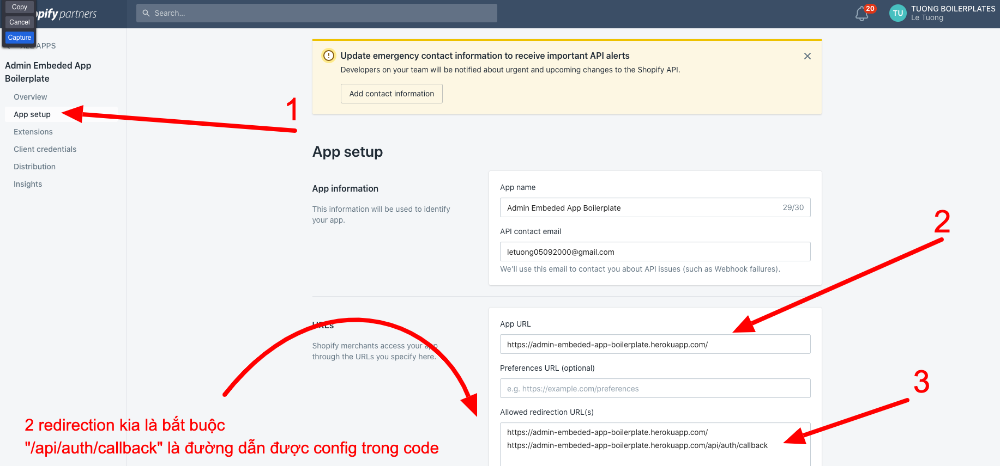
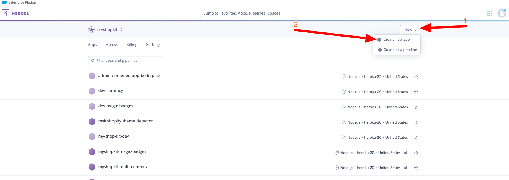
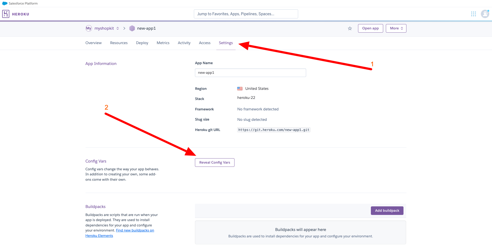
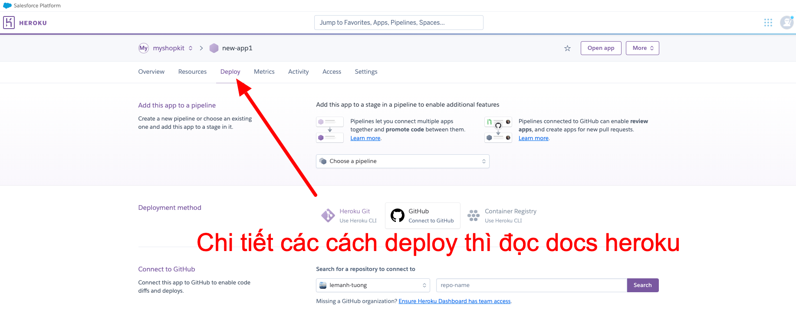
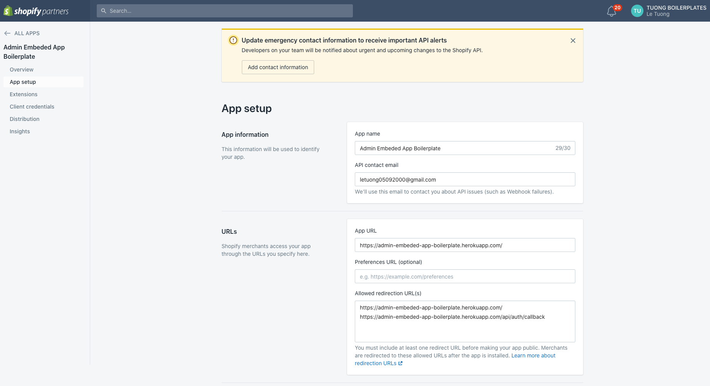
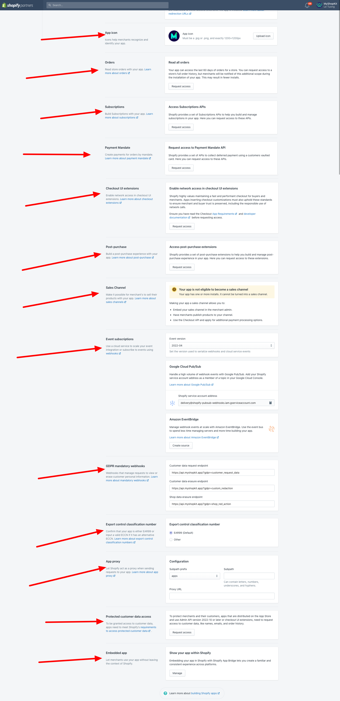
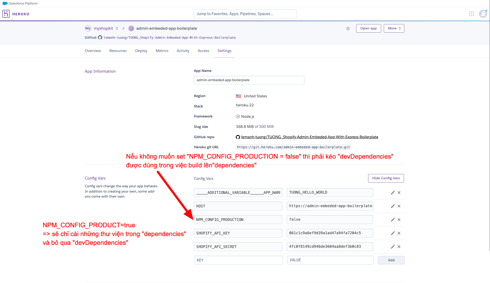
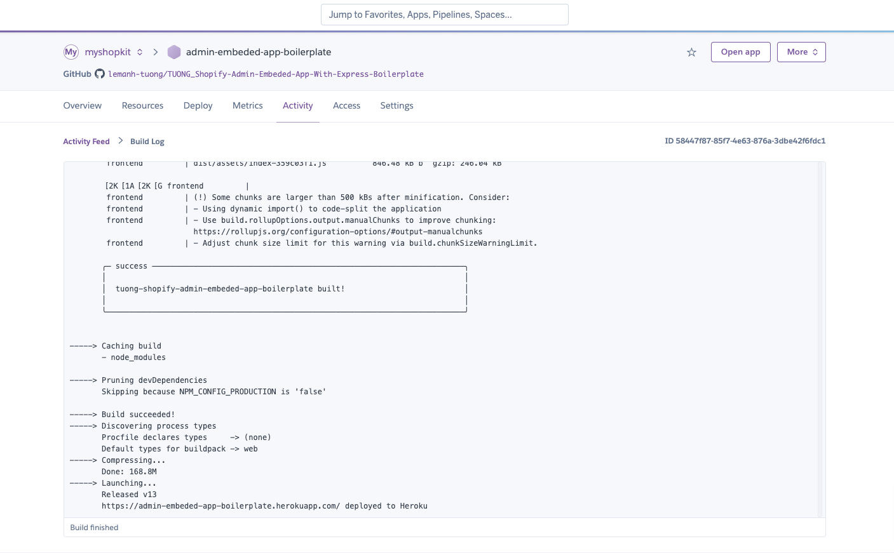
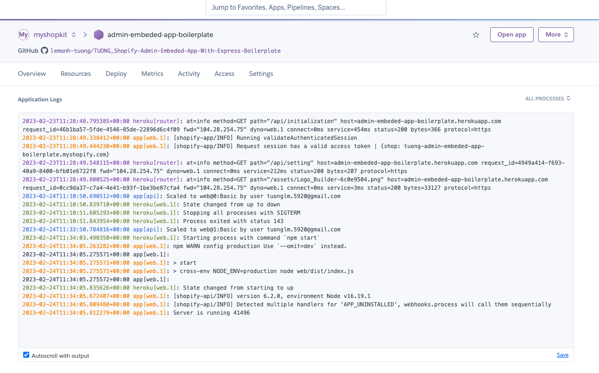

## Các bước deploy heroku
1. Setup shopify app in partner
  1.1 Tại dashboard team chọn "Create New App" 
  1.2 Các phần còn lại (App Logic, Rule, ...) sẽ được người khác setup

2. Tạo app heroku
  2.1 Tại dashboard team chọn "Create New App" 
  2.2 Setup biến môi trường cần thiết  
  2.3 Deploy 
  2.4 Theo dõi kết quả build
  2.5 Xem log xem server đã được start hay gặp lỗi

## Example
1. Kết quả của "Setup shopify app in partner"
  - Kết quả bước 1.1 
  - Kết quả bước 1.2 

2. Kết quả của "Tạo app heroku"
  - Env setup 
  - Build log 
  - Server log 