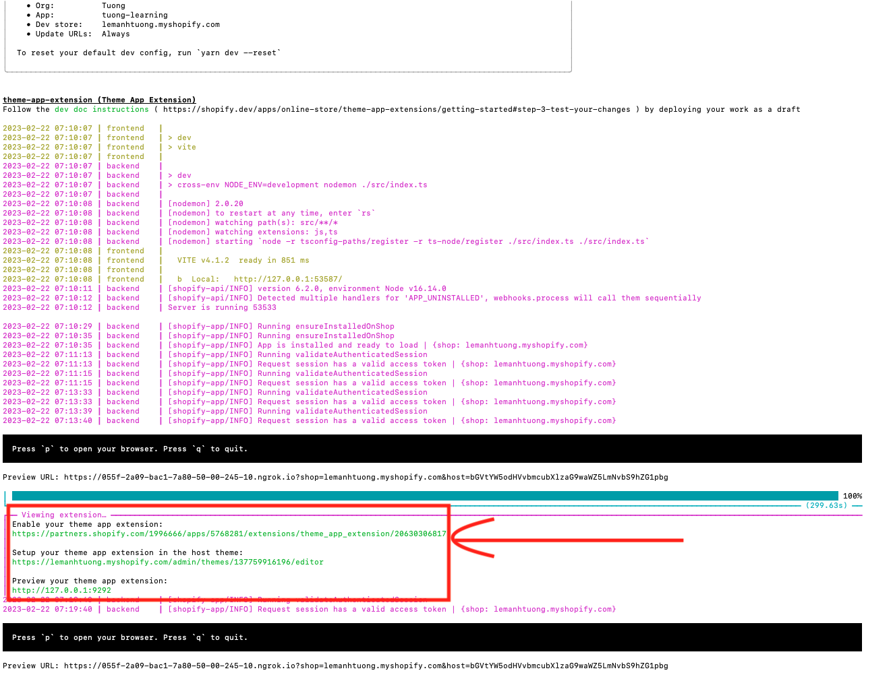
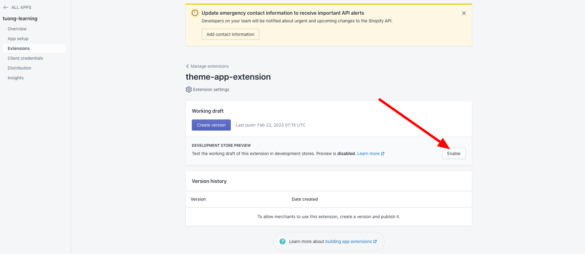
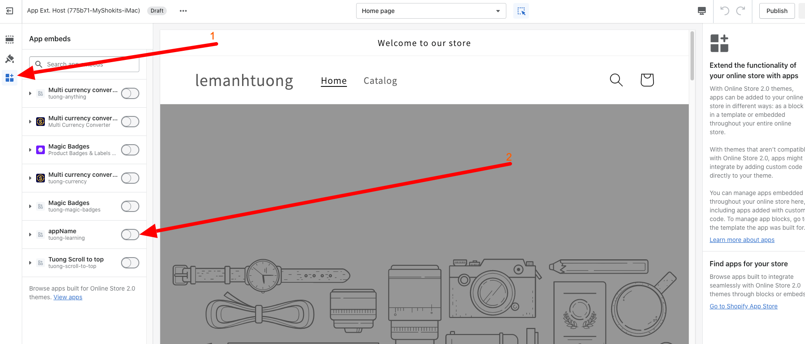
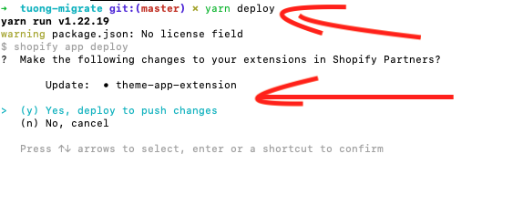
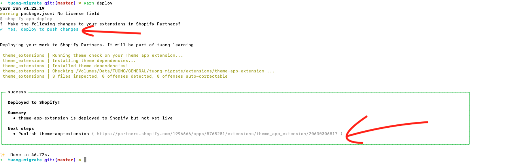
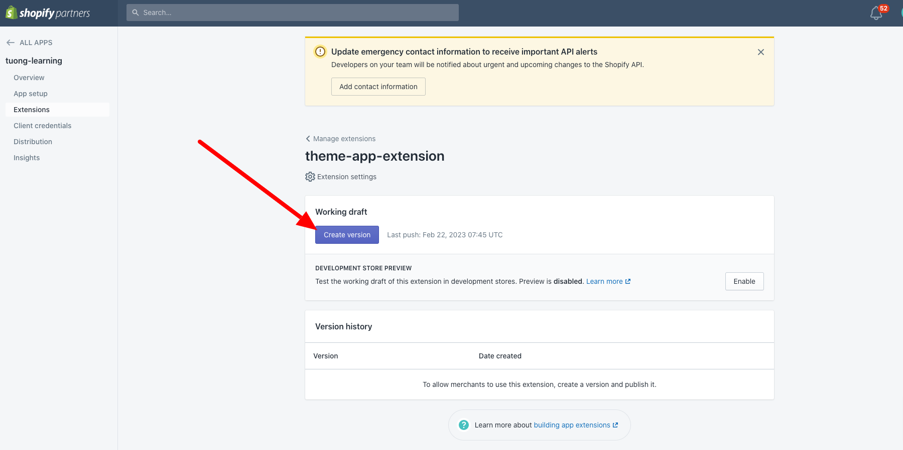
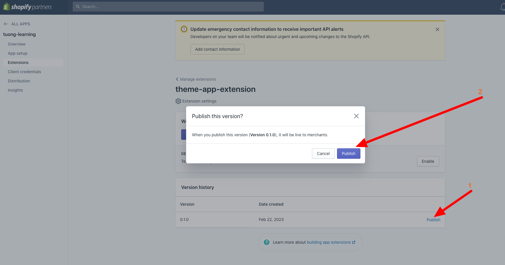

# Get started

#### Relate documentations
- [Getting started with theme app extensions](https://shopify.dev/docs/apps/online-store/theme-app-extensions)
- [Theme architecture](https://shopify.dev/docs/themes/architecture)
- [Liquid](https://shopify.dev/docs/api/liquid)

## Các bước khởi tạo extension để dev
1. Chạy "yarn generate extension"
2. Tạo file js và css tại folder "assets"
3. Tạo file liquid tại folder "blocks"
4. Chạy "yarn dev"
5. Khi đó tại terminal sẽ có thông báo 3 đường link 
6. Truy cập đường link thứ 1 - "https://partners.shopify.com/..." và "Enable development stores" 
7. Truy cập đường link thứ 2 - "https://SHOPNAME.myshopify.com/admin/themes/137759916196/editor" và bật theme app extension của app lên 
8. Tại link 3 ta có thể preview theme app extension chạy trên shop hoặc có thể preview ngay tại shopify editor ngay khi active theme app extension tại bước trên

#### Example code
##### Css
```css
/* NOTE: Nên deploy css lên 1 nơi nào đó và load = js để không phải create new version mà chỉ cần deploy lại là mọi thứ ok luôn */
/** assets/app.css */
/** Css của app */
```
##### Js
```javascript
/* NOTE: Nên deploy js lên 1 nơi nào đó và load = js này để không phải create new version mà chỉ cần deploy lại là mọi thứ ok luôn */
// assets/app.js
/** JS của app */
```

##### Liquid
```liquid
 Lưu ý. Có thể dùng biến liquid global 
 blocks/app.liquid 

<div is="appName"></div>

 
  DANGER: "app.js" và "app.css" có thể sẽ không được load vào shop khách. Điều này là một thứ khó hiểu của shopify 
  ===> Tại file liquid này nên viết 1 đoạn js để load cả js và css của app vào 

  - shop không được chèn js: https://valout.net/ - App: Magic Badges
  - shop không được chèn css: https://mvmntlmtd.com  - App: Magic Badges


{
  "name": "APP_NAME",  APP_NAME là tên app sẽ hiển thị trong shopify editor như hình tại bước "active theme app extension" 
  "target": "body",
  "javascript": "app.js", 
  "stylesheet": "app.css",
  "settings": []
}

```

### Deploy & update version

- Lưu ý mỗi khi muốn js, liquid, css thay đổi ta cần thực hiện update version theme app extension. Khi đó js, css, liquid hiển thị trên shop khách mới được update

### Các bước deploy & update version
1. Chỉnh sửa code
2. Chạy "yarn deploy" và chọn các options 
3. Truy cập link được trả về 
4. Tại trang partner vừa truy cập thực hiện "Create new version" 
5. Thực hiện "Publish" version vừa tạo 
6. Đợi shopify vài phút và test code mới 