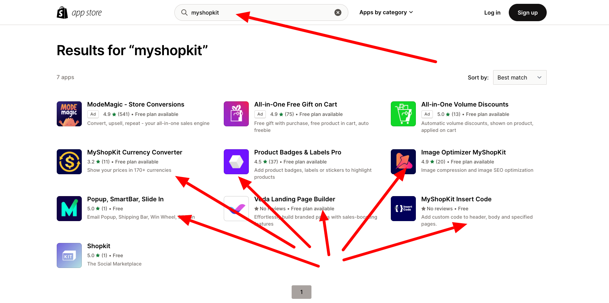
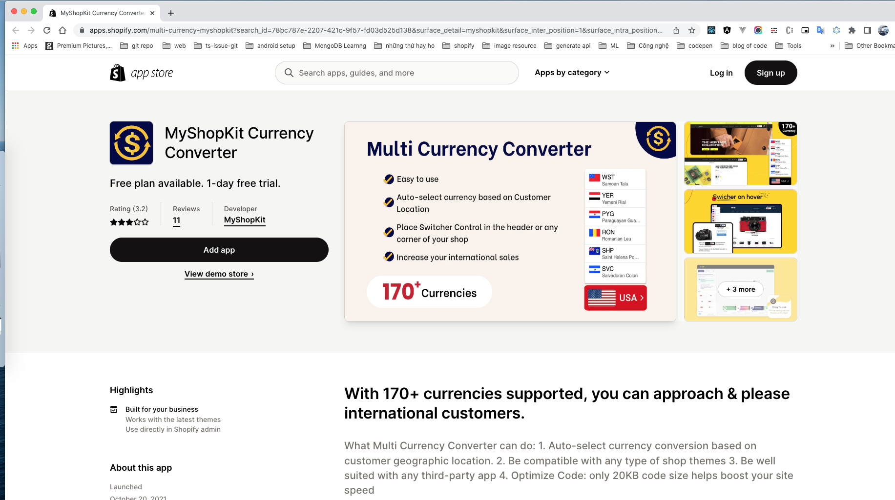
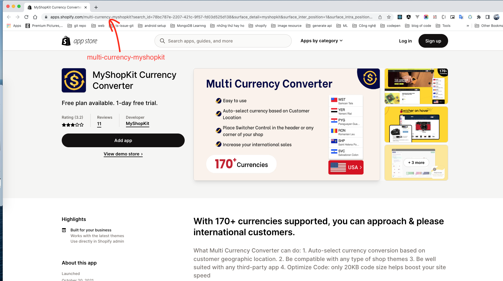
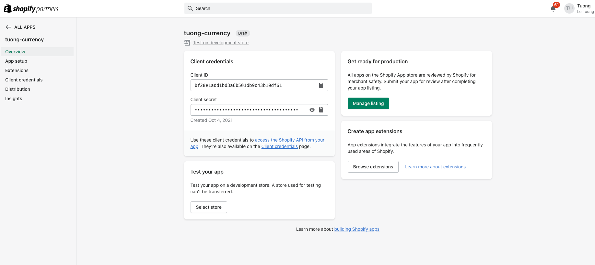
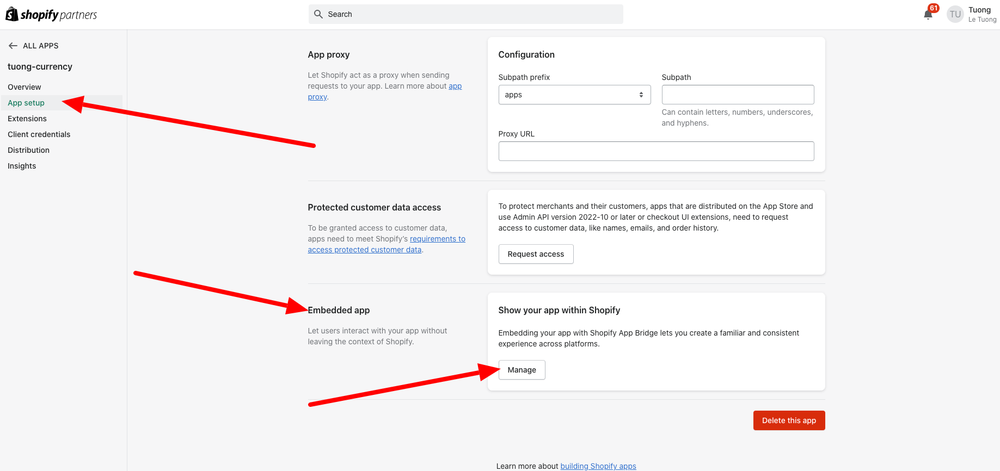
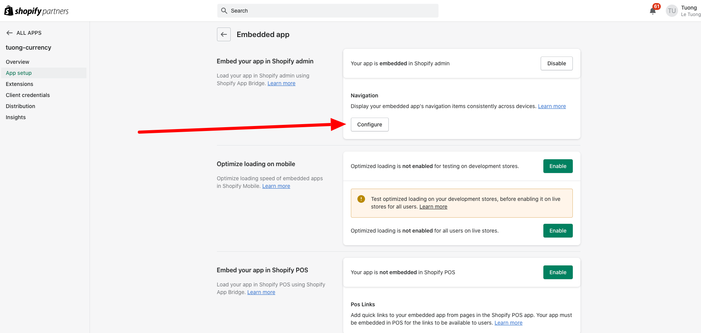
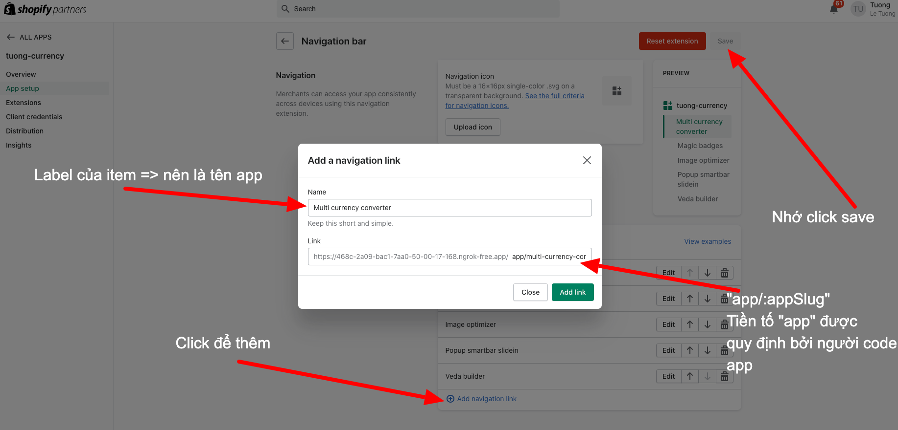

## Cách lấy "appSlug"
1. Tìm kiếm ["Myshopkit"](https://apps.shopify.com/search?q=myshopkit) trên shopify app store

2. Truy cập "Một app bất kì được phát hành bởi Myshopkit" 
3. Lấy app slug từ url 

## Cách setup "Navigation" cho "Shopify embededa app"
1. Truy cập trang thông tin app tại "Partner" 
2. Tìm kiếm từ khoá "Embeded app" và click nút "Manage" như hình
3. Tại màn hình "Cài đặt embeded app" được hiển thị sau bước 2 click nút "Configure" như hình 
4. Tiến hành "Add navigation link" 